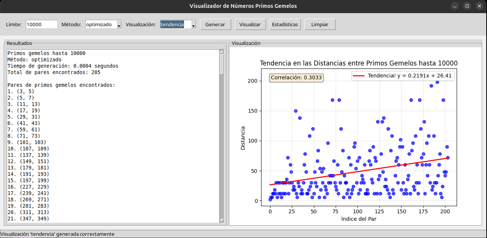
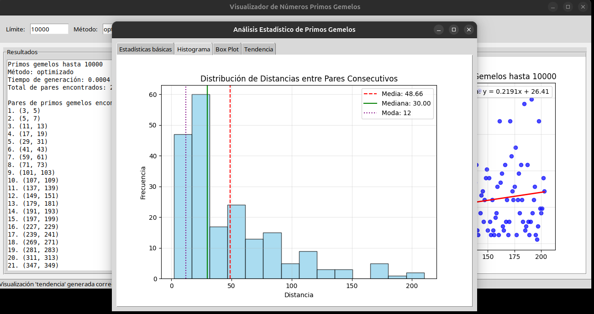
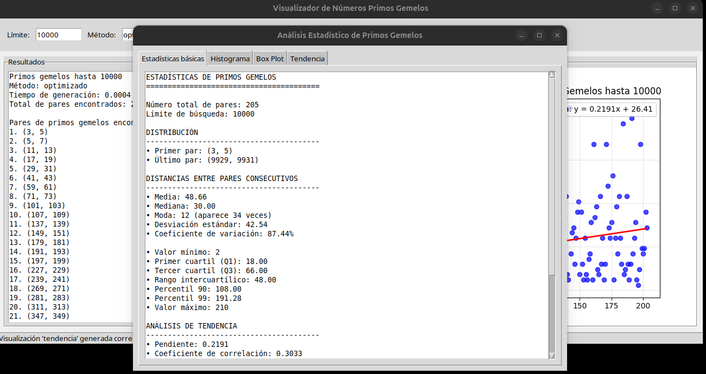

# Visualizador de Números Primos Gemelos v0.3



Este proyecto permite generar y visualizar números primos gemelos de diferentes formas para ayudar a comprender sus patrones y distribución. Incluye múltiples visualizaciones y análisis estadísticos avanzados.

## Tecnologías utilizadas


## ¿Qué son los Números Primos Gemelos?

Los números primos gemelos son pares de números primos que están separados por un solo número (es decir, su diferencia es 2). Por ejemplo:
- (3, 5)
- (5, 7)
- (11, 13)
- (17, 19)

Una característica interesante es que se vuelven más escasos a medida que los números aumentan, pero la conjetura de los primos gemelos sugiere que existen infinitos pares.

## Estructura del Proyecto

El proyecto se compone de varios archivos, cada uno con una función específica:

- **gemelos.py**: Implementación básica del algoritmo para generar primos gemelos y visualizaciones en modo consola
- **optimizado.py**: Versión optimizada usando la Criba de Eratóstenes, significativamente más rápida para límites grandes
- **estadisticas.py**: Análisis estadístico detallado de los patrones de primos gemelos
- **interfaz.py**: Interfaz gráfica para facilitar la visualización e interacción, incluyendo exportación de datos a CSV
- **run.sh**: Script para configurar el entorno y ejecutar el programa automáticamente
- **requirements.txt**: Lista de dependencias necesarias
- **ejemplo.csv**: Archivo de ejemplo que muestra el formato de exportación CSV

## Requisitos

Para ejecutar este programa necesitas:

```
Python 3.6+
NumPy
Matplotlib
SciPy
```

Puedes instalar las dependencias con:

```
pip install -r requirements.txt
```

O ejecutar directamente:

```
./run.sh
```

El script run.sh detectará automáticamente la versión de Python, creará un entorno virtual si es necesario e instalará las dependencias.

## Cómo usar

1. Ejecuta el programa usando una de estas opciones:
   ```
   ./run.sh        # Método recomendado, configura todo automáticamente
   python interfaz.py  # Ejecuta la interfaz gráfica directamente
   python gemelos.py   # Ejecuta la versión de consola
   ```

2. Introduce el límite hasta donde quieres generar primos gemelos (por ejemplo, 10000).

3. Elige entre las diferentes visualizaciones:
   - Recta numérica: muestra los pares conectados en una línea
   - Análisis de tendencia: analiza la evolución de las distancias entre pares consecutivos
   - Patrón en espiral: muestra los primos gemelos en una espiral de Arquímedes
   - Histograma de distancias: analiza la separación entre pares consecutivos

4. Opciones adicionales:
   - **Exportar CSV**: Puedes exportar los pares de primos gemelos a un archivo CSV para su posterior análisis en otras herramientas. El archivo incluye:
     - Índice del par
     - Primer número primo
     - Segundo número primo
     - Diferencia (siempre 2 para primos gemelos)
   
   Ejemplo de formato CSV:
   ```
   Índice,Primer Primo,Segundo Primo,Diferencia
   1,3,5,2
   2,5,7,2
   3,11,13,2
   ```

## Visualizaciones disponibles

### 1. Recta Numérica
Muestra los primos gemelos como puntos conectados sobre una recta numérica, lo que ayuda a visualizar su distribución espacial.

### 2. Análisis de Tendencia
Visualiza cómo evolucionan las distancias entre pares consecutivos de primos gemelos, incluyendo la línea de tendencia y coeficiente de correlación. Permite observar si las separaciones tienden a aumentar con valores más grandes.

### 3. Patrón en Espiral
Visualiza los primos gemelos en una espiral de Arquímedes, revelando patrones radiales y simetrías interesantes que no son evidentes en representaciones lineales.

### 4. Histograma de Distancias
Analiza la distribución de frecuencias de las distancias entre pares consecutivos de primos gemelos, mostrando la media, mediana y otras estadísticas relevantes.



## Análisis Estadístico

El programa incluye un completo análisis estadístico con:



- **Estadísticas Básicas**:
  - Media, mediana y moda de las distancias
  - Desviación estándar y coeficiente de variación
  - Valores mínimos y máximos
  - Cuartiles y percentiles (Q1, Q3, P90, P99)
  - Rango intercuartílico

- **Análisis de Tendencia**:
  - Línea de regresión lineal
  - Coeficiente de correlación
  - Visualización de pendiente e intercepto

- **Densidad y Proporción**:
  - Densidad observada (pares por cada 100 números)
  - Comparación con la densidad teórica estimada
  - Proporción de primos que forman parte de pares gemelos

- **Visualizaciones Estadísticas**:
  - Histogramas de distribución
  - Box plots
  - Gráficos de dispersión con líneas de tendencia
  - Análisis comparativo con la teoría

## Rendimiento

El proyecto incluye dos implementaciones:

1. **Método Básico** (gemelos.py): Adecuado para límites pequeños (<10,000)
2. **Método Optimizado** (optimizado.py): Usa la Criba de Eratóstenes, significativamente más rápido para límites grandes

Para límites grandes (más de 100,000) se recomienda usar siempre el método optimizado. Las imágenes generadas se guardan automáticamente en el directorio de trabajo.

## Autor

[@https://github.com/686f6c61](https://github.com/686f6c61) 